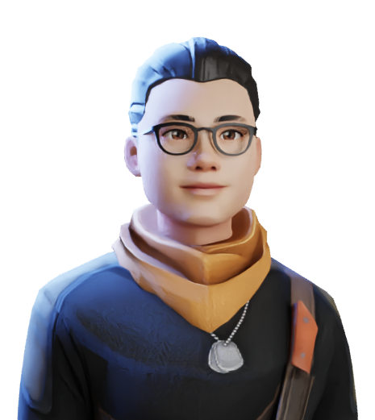

# CryptoWar Team

Cryptowar has 20+ team members in a group of diverse and complemented backgrounds: coding, private equity and venture capital, digital media, and business operation. The core team knows each other personally and have worked together for 10+ years over various ups and downs in multinational firms as well as high growth startups with multi-million dollars in VCs and corporate funding.

We engaged into crypto space back in early 2013 when Bitcoin was only a few $ and ETH is non-existence. In 2020, after acquiring enough experience and observation over the crypto market, we gathered to make a push for a company in DeFi space that targets to become a wealth creation engine for token holders. That's how we come up with XBN and various of its migration rewards and hold-to-claim bonus programs.

In mid of 2021, realizing the implications that NFTs can revolutionize gaming into a field where players can play and make a living from their investments and efforts, we developed our first game, CryptoWar xBlade, that aims to be our core product for GameFi space. We emerge ourselves into Metaverse developments and are working day and night to create new features into CryptoWar so that Cryptowar can be an intersection of gaming, virtual social, and finance.

|                                |   |
| :----------------------------: | - |
|  |   |
|                                |   |
|                                |   |
|                                |   |

#### Work hard. Have Fund. Make History!
