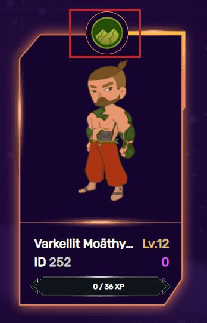
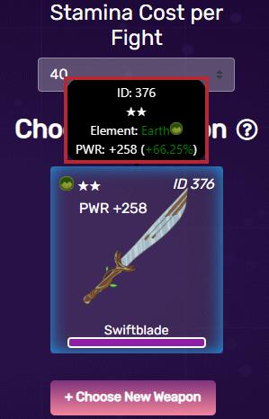

# Tính Toán Sức Mạnh

## Sức Mạnh của Hero

Sức mạnh của Hero được thiết kế là biến được sử dụng để xác định phạm vi cuộn sức mạnh của đối phương.

Các yếu tố bắt buộc để tính toán điều này là:

| Yếu tố                            | . | **Mô tả**                                                                                                                                            |
| --------------------------------- | - | ---------------------------------------------------------------------------------------------------------------------------------------------------- |
| **Sức Mạnh của Hero**             | . | Sức mạnh của Hero là sức mạnh được liệt kê được hiển thị ở phía trên bên trái của màn hình phía trên thanh sức chịu đựng khi một nhân vật được chọn. |
| **Cơ sở thuộc tính vũ khí**       | . | Cơ sở thuộc tính vũ khí là tổng của tất cả các giá trị thuộc tính của vũ khí mà không tính đến sự kết hợp nguyên tố.                                 |
| **Sức mạnh cộng thêm của vũ khí** | . | Sức mạnh cộng thêm của vũ khí là giá trị sức mạnh cộng thêm được liệt kê nếu vũ khí đã được nâng cấp.                                                |

Công thức hiện tại để tính công suất không đổi là

$$
unalignedPower = (((attributeTotal * 0.0025) + 1)
 * charPower) +bonusPower
$$

Sau khi chúng tôi tính toán cho công suất không liên kết, chúng tôi áp dụng ± 20% để xác định phạm vi giá trị mà giá trị công suất của đối phương có thể là.


Hãy làm một phép tính mẫu giả sử các giá trị sau:

* Sức mạnh Hero- 1000 (nhân vật cấp một)
* Tổng thuộc tính - 800 (vũ khí 4 sao thuộc tính tối đa)
* Sức mạnh cộng thêm - 1500 (vũ khí 100/100 LB, 0/25 4B, 0/10 5B)
* Sức mạnh không điều chỉnh lên đến 4500.
* 4500 \* 0,8 được làm tròn đến số nguyên gần nhất là 3600, là Sức mạnh kẻ thù tối thiểu.
* 4500 \* 1.2 được làm tròn đến số nguyên gần nhất là 5400, là Sức mạnh kẻ thù tối đa.




## Sức mạnh Hero được căn chỉnh

Cùng với Lơi thế thuộc tính, Sức mạnh Nhân vật Căn chỉnh được sử dụng để xác định điểm chiến đấu của người chơi.

Các biến cần thiết cho kết quả tính toán của Sức mạnh ký tự được căn chỉnh tương tự như các biến của Sức mạnh ký tự không được căn chỉnh được đề cập ở trên. Điểm khác biệt là trò chơi sử dụng Sức mạnh nhân vật được căn chỉnh thay vì Sức mạnh nhân vật không được căn chỉnh để thực hiện phép tính.

|                             |   |                                                                                            |
| --------------------------- | - | ------------------------------------------------------------------------------------------ |
| **Cơ sở thuộc tính vũ khí** |   | Cơ sở thuộc tính vũ khí là tổng của tất cả các giá trị thuộc tính của vũ khí không bao gồm |

Sử dụng sức mạnh Hero được căn chỉnh

| Thuộc tính vũ khí được nhâ**n** | . | Nhân thuộc tính vũ khí là tổng của tất cả các giá trị thuộc tính của vũ khí sau khi áp dụng hệ số nhân cho từng thuộc tính dựa trên kết hợp nguyên tố. |
| ------------------------------- | - | ------------------------------------------------------------------------------------------------------------------------------------------------------ |

Thay vì công thức chỉ đơn giản là tổng hợp tất cả các thuộc tính của vũ khí, thay vào đó chúng tôi đánh giá từng thuộc tính riêng biệt và áp dụng các phép tính sau để xác định giá trị của chúng

```
if attributeElement != charElement (attributeValue * 0.0025)
if attributeElement == PWR (attributeValue * 0.002575)
if attributeElement == charElement (attributeValue * 0.002675)
```

Sau khi mỗi thuộc tính đã được đánh giá, chúng sẽ được tính tổng và được sử dụng theo cùng một công thức với quyền lực không căn chỉnh để có được sức mạnh được căn chỉnh.

$$
alignedPower = ((evaluatedAttributeTotal + 1) * charPower) + bonusPower
$$


Hãy thực hiện một phép tính mẫu khác giả sử các giá trị sau:&#x20;

Sức mạnh nhân vật - 1000 (nhân vật cấp một)

&#x20;Yếu tố nhân vật - Lửa

&#x20;Thuộc tính 1 - STR 400

&#x20;Thuộc tính 2 - CHA 400

&#x20;Sức mạnh cộng thêm - 1500 (vũ khí 100/100 LB, 0/25 4B, 0/10 5B)

&#x20;Sức mạnh được căn chỉnh lên đến 4570.


Sức mạnh Căn chỉnh được sử dụng như khi tính toán kinh nghiệm nhận được hoặc nhân với Tiền thưởng Đặc điểm khi tính toán lượt chiến đấu của người chơi.

## Điểm cộng chỉ số thuộc tính





Chỉ số thuộc tính là một biến số được nhân với Sức mạnh Căn chỉnh và được sử dụng để xác định lượt chiến đấu của người chơi.

Theo công thức sau:&#x20;

```
TraitBonus = 1
if charElement == weaponElement (TraitBonus += 0.075)
if charElement > enemyElement (TraitBonus += 0.075)
if charElement < enemyElement (TraitBonus -= 0.075)
```

Lợi thế nguyên tố liên quan đến tính cách chống lại kẻ thù như sau:

* Lửa thắng Đất
* Đất  thắng Sấm Sét
* Sấm Sét thắng Nước
* Nước thắng Lửa

Lợi thế nguyên tố được đánh giá và sau đó nhân với Sức mạnh Căn chỉnh để nhận được giá trị sức mạnh cuối cùng của người chơi.

Sau đó,  ± 20% được áp dụng cho giá trị cuối cùng để xác định sức mạnh chiến đấu của người chơi.


Lấy Công suất được căn chỉnh được tính toán ở trên, hãy giả sử các biến sau:

&#x20;Yếu tố nhân vật - Lửa

&#x20;Nguyên tố vũ khí - Nước

&#x20;Nguyên tố kẻ thù - Đất

&#x20;Chỉ số thuộc tính lên tới 1.075.

&#x20;Giá trị Sức mạnh cuối cùng sau khi áp dụng lợi thế nguyên tố cho Sức mạnh Căn chỉnh ở trên là 4912.&#x20;

Sức mạnh người chơi tối thiểu là 4912 \* 0,8 làm tròn xuống 4420.&#x20;

Sức mạnh người chơi tối đa là 4912 \* 1.2 được làm tròn xuống thành 5403.


## Sức mạnh đối thủ

Sức mạnh của kẻ thù là một phép tính ± 20% đơn giản được áp dụng cho sức mạnh kẻ thù được liệt kê của bất kỳ kẻ thù nào mà người chơi đã chọn.

Giá trị số được liệt kê trên nút màn hình chiến đấu được sử dụng để xác định kinh nghiệm và các khoản thanh toán xBlade.

Giá trị được tính toán với ± 20% được áp dụng được sử dụng để xác định các cuộn của kẻ thù trong chiến đấu
