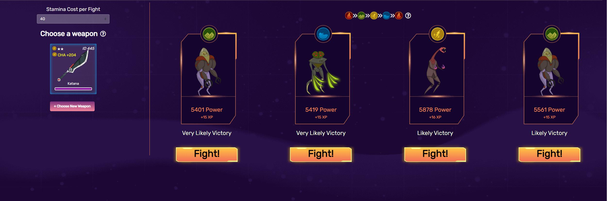

# Công Thức Chiến Đấu

## Các yếu tố&#x20;

Chiến đấu trong CryptoWar sử dụng một tập hợp các biến được tính toán từ dữ liệu NFT mà người chơi sở hữu. Các biến này được trình bày như sau.

* Sức mạnh của Hero không được chỉ định được tính bằng cách sử dụng cấp độ hiện tại của Hero và vũ khí đã chọn mà không tính đến bất kỳ kết hợp nguyên tố nào.
* Sức mạnh của nhân vật được căn chỉnh tương tự như trên, ngoại trừ việc tính đến nếu bất kỳ thuộc tính nào khớp với nguyên tố của Hero hoặc nếu thuộc tính đó là PWR.
* Lợi thế thuộc tính được tính bằng cách kiểm tra nguyên tố của Hero và đánh giá xem nó mạnh, trung tính hay yếu trước nguyên tố của kẻ thù đã chọn.
* Sức mạnh của kẻ thù là giá trị sức mạnh được liệt kê của kẻ thù được chọn và được sử dụng để xác định điểm chiến đấu của kẻ thù và phần thưởng.

Sử dụng thông tin trên, chúng tôi có thể rút ra một số kết luận cho cuộc chiến CryptoWar được viết ra bên dưới.

## Kết Hợp Nguyên Tố

Chọn một kẻ thù mà bạn có lợi thế về nguyên tố, so sánh nguyên tố của vũ khí với nhân vật của bạn và so sánh thuộc tính của vũ khí với nhân vật của bạn là ba yếu tố cần cân nhắc khi so sánh nguyên tố.

Dựa trên các công thức chiến đấu, chúng ta có thể đưa ra một số tuyên bố chính xác.

* Các yếu tố phù hợp rất quan trọng đối với tính toán tỷ lệ thắng và tăng kinh nghiệm.
* Các yếu tố phù hợp KHÔNG quan trọng trong việc tính toán phạm vi sức mạnh của đối phương.
* Các yếu tố phù hợp KHÔNG quan trọng trong việc tính toán khoản thanh toán xBlade.

## Công Thức

Trận chiến bắt đầu bằng cách xác định Sức mạnh của Nhân vật Không xác định và sử dụng nó để xác định phạm vi kẻ thù để lựa chọn.

Công thức để có được điều đó và các biến khác có thể được tìm thấy tại đây:


[calculating-player-power.md](calculating-player-power.md)


Sau khi đã xác định được Sức mạnh của nhân vật không cân bằng, trò chơi sẽ lấy giá trị đó và áp dụng ± 20% để xác định phạm vi giá trị sức mạnh của kẻ thù có thể có.


± 20% này có nghĩa là bạn sẽ không bao giờ nhận được một kẻ thù không thể đánh bại, mặc dù bạn có thể khó thắng kẻ thù nếu bạn không có lợi thế về kết hợp nguyên tố bên mình.


Sau đó người chơi sẽ tiến hành chọn kẻ thù để chiến đấu và xác nhận giao dịch. Hợp đồng sẽ tính toán cho Lợi Thế Thuộc Tính và sức mạnh Hero được căn chỉnh của người chơi và sử dụng các giá trị đó để xác định lượt chiến đấu của người chơi và kinh nghiệm thu được khi chiến thắng.

Lượt của người chơi được tính bằng cách nhân Sức mạnh của nhân vật được căn chỉnh với Tiền thưởng đặc điểm và áp dụng ± 20%.

Lượt của kẻ thù được tính bằng cách lấy giá trị công suất được liệt kê của chúng và áp dụng ± 20%.

Nếu kết quả sức mạnh của người chơi bằng hoặc lớn hơn của đối phương, họ sẽ thắng cuộc chiến. Kinh nghiệm và các khoản thanh toán xBlade sau đó có thể được tính toán. Các công thức được sử dụng để lấy chúng có thể được tìm thấy ở đây:


[combat-rewards.md](combat-rewards.md)

