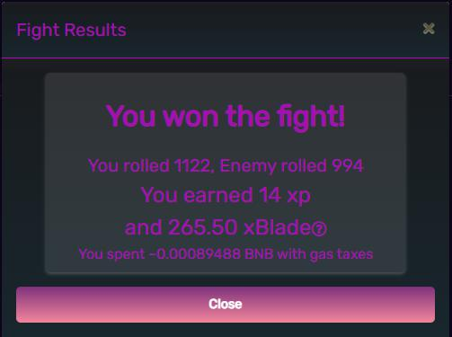

# Phần Thưởng

## Điểm năng lượng mỗi trận đấu

Người chơi có thể quyết định mức thể lực mà họ muốn chi cho một trận chiến và có thể tiêu tốn tới 200 thể lực trong một lần.

Phần bù gas được thanh toán một lần cho mỗi giao dịch, vì vậy nếu người dùng quyết định chi tiêu 200 sức chịu đựng, họ sẽ nhận được gấp 5 lần phần thưởng cơ bản đã đánh giá, nhưng phần bù gas chỉ một lần.

Mức tăng giá trị đô la dự kiến ​​là tương đương cho tất cả các mức chi tiêu sức chịu đựng khi tính tiền xăng, tuy nhiên, thu nhập trong một khoảng thời gian trung bình có thể khác nhau nếu người chơi thua nhiều trận đấu có sức chịu đựng cao.

Kinh nghiệm nhận được trong các trận chiến cũng được nhân lên tương ứng tùy thuộc vào bất kỳ giá trị sức chịu đựng nào mà người chơi chọn bỏ ra.

## Thanh toán xBlade

Công thức để xác định khoản thanh toán của xBlade như sau:

> payout = gasOffset + (baseline \* √(enemyPower/1000))

Chênh lệch gas được hiển thị trong máy tính thu nhập như sau:

Những con số này được Oracle điều chỉnh động, có tính đến giá trị đô la của xBlade.


Lưu ý rằng biến "sức mạnh" được chỉ ra trong công thức là giá trị sức mạnh được liệt kê của bất kỳ kẻ thù nào mà người chơi chọn để chiến đấu.

