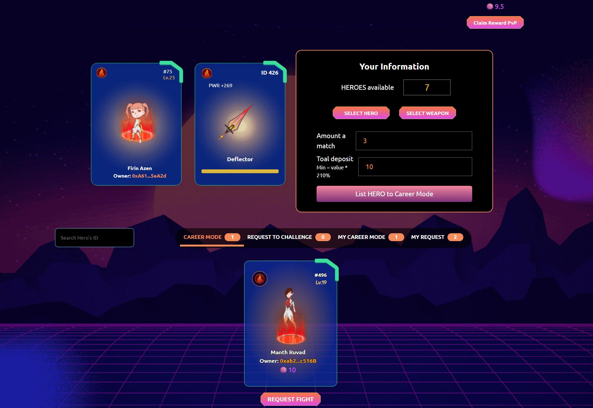

# Career Mode - Phòng Thủ

Đầu tiên chọn Hero và Vũ Khí bạn muốn đặt lên đài thách đấu. Nhập vào số xBlade bạn muốn đặt cược cho 1 trận và tổng số xBlade muốn cược vào:

Ấn " List HERO to Career Mode " và bạn sẽ thấy Hero của mình trong danh sách như hình dưới đây:

.jpg>)

.jpg>)
