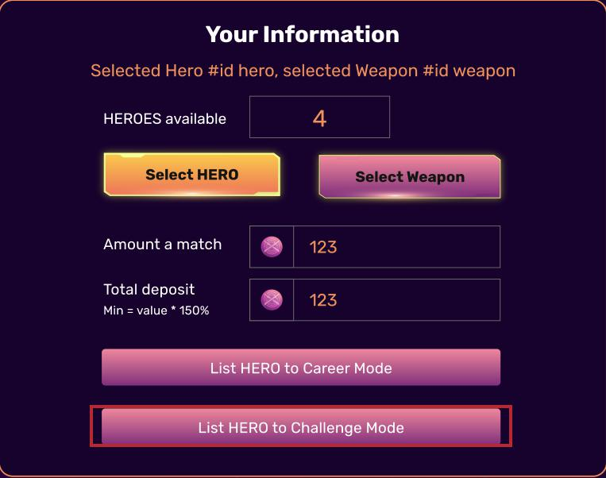
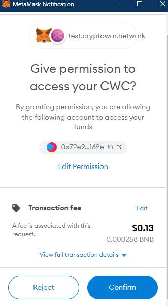

# Challenge Mode - Phòng Thủ

Đầu tiên, hãy lựa chọn Hero mà bạn muốn sử dụng trong chiến đấu.

.jpg>)

Sau đó ấn " List HERO to Challenge Mode " . Bạn không cần nhập số tiền đặt cược khi ở vị thế này.

Bạn có thể thấy Hero của mình trong tab Challenge Mode như dưới đây:

Bây giờ chờ đợi lời thách đấu từ những người chơi khác, bạn có thể chấp nhận hoặc từ chối lời thách đấu.

.jpg>)
