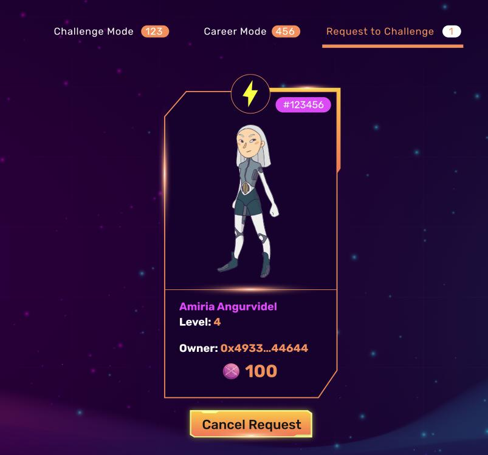

# Challenge Mode - Tấn Công

Đầu tiên hãy chọn Hero yêu thích của bạn

.jpg>)

Sau đó lựa chọn đối thủ bạn muốn khiêu chiến, nhập vào số xBlade bạn muốn đặt cược cho trận chiến đó như dưới đây:&#x20;

Xác nhận và đợi đối thủ trả lời mời thách đấu của bạn.

Bạn có thể thấy lời mời đã gửi của mình tại tab " Request to Challenge " và có thể Hủy nếu muốn hoặc phải chờ quá lâu.

