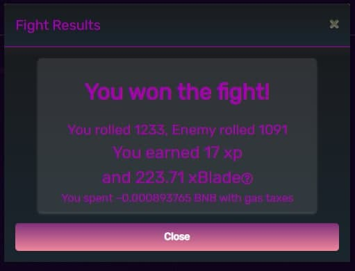

# Phần Thưởng

Ngay sau khi người chơi tiêu diệt kẻ thù của mình thành công, họ sẽ được thưởng xBlade và kinh nghiệm nhân vật. Phần thưởng xBlade phụ thuộc vào sức mạnh của kẻ thù bị đánh bại. Tại thời điểm wiki này được viết, công thức là 0,111627 (được thưởng như một phần bù khí) + 0,14651 trên 1000 sức mạnh của kẻ thù bị đánh bại. Kinh nghiệm kiếm được sẽ được gán cho nhân vật thắng trận.

&#x20;XBlade và kinh nghiệm kiếm được được lưu trữ cho đến khi người chơi bắt đầu giao dịch để chuyển xBlade vào ví của họ và áp dụng kinh nghiệm cho nhân vật của họ. Tính năng này đã được thêm vào để giảm lượng xăng mà người chơi yêu cầu để chơi trò chơi.

