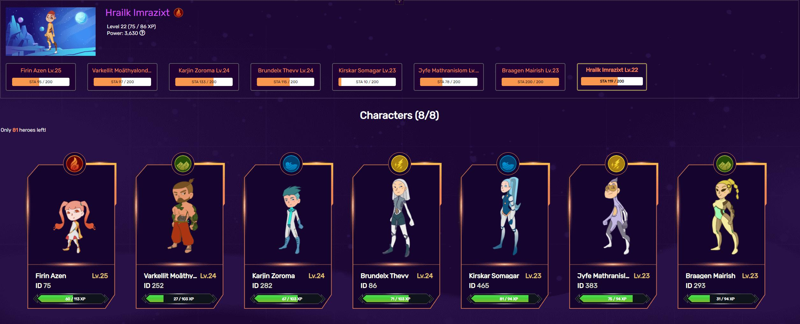

# HERO

Hero là một trong những NFT chính mà người chơi có thể sở hữu trong CryptoWar. Mỗi tài khoản có thể chứa tối đa tám Heroes tại bất kỳ thời điểm nào. Giá cho Hero khi đúc được hiển thị trên nút trong mục Plaza. Tất cả xBlade chi cho việc đúc nhân vật sẽ được gửi đến hợp đồng xử lý các khoản thanh toán chiến đấu. Mỗi Hero bắt đầu ở cấp một và đi kèm với một yếu tố ngẫu nhiên khi đúc. Hiện tại không có cách nào để thay đổi nguyên tố của một Hero.

## CWC

CWC là viết tắt của CryptoWar Character, và là ký tự NFT có trên ví của bạn.

Nếu bạn muốn CWC hiển thị trên ví MetaMask của mình, bạn có thể thêm mã thông báo thông qua địa chỉ hợp đồng được tìm thấy bên dưới:

> 0xC38470BFE1b08c3baFDaf699eBa2fCA1fd2B040B


Set the decimal to "0" if prompted.


## Hệ Nguyên Tố của Hero

Mỗi Hero có thể sở hữu một trong bốn nguyên tố khác nhau (Lửa, Đất, Sấm Sét, Nước).

Nguyên tố của Hero được sử dụng để xác định các phép tính lợi thế và hệ số nhân trong chiến đấu.

Có thể tìm thấy thêm thông tin về cách các nguyên tố Hero được sử dụng ở đây:


[fighting](../fighting/)


## Điểm năng nượng

Mỗi nhân vật có tổng thể lực riêng của họ, với số lượng tối đa là 200.

Điểm năng lượng sẽ được hồi lại theo một thời gian nhất định tương ứng với cấp độ của Hero.

Điểm năng lượng được sử dụng khi người chơi tham gia chiến đấu, với tỷ lệ 40/80/120/160/200 sức chịu đựng mỗi trận đấu tùy thuộc vào chi phí sức chịu đựng đã chọn của người chơi mỗi trận đấu.

Số điểm năng nượng sử dụng trên mỗi trận chiến càng cao phần thưởng nhận được khi chiến thắng càng lớn.

