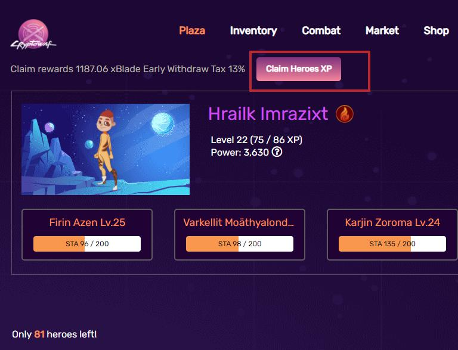

# Cấp độ của Hero

Mỗi Hero bắt đầu từ cấp một, để lên cấp, nhân vật phải có kinh nghiệm thông qua các trận chiến thắng.

Các cấp độ của Hero xác định lượng sức mạnh mà họ có trong quá trình tính toán chiến đấu, và lần lượt xác định phần thưởng xBlade  nếu chiến thắng.

## Cách tính điểm EXP

Để tính xem đã đủ điểm EXP để lên cấp cho Hero chưa, bạn có thể tạo một bản sao của bảng tính sau và kiểm tra: [CryptoWar Experience Calculator](https://docs.google.com/spreadsheets/d/1auVAnRlsoxwKQTFX3\_ZZluteJ8DxeZIQio\_jLK21ijs/edit?usp=sharing) .

Tổng quan về bảng trải nghiệm có thể được tìm thấy bên dưới:

## Khi nào nên nhận điểm EXP ?

Kinh nghiệm giành được qua các trận chiến được lưu trữ trong thanh Phần thưởng, tương tự như xBlade

Người chơi nên tính toán điểm kinh nghiệm đủ để lên cấp và nhận về để nâng cấp độ cho Hero của mình. Cấp độ Hero càng cao, phần thưởng nhận được càng lớn.

## Sức mạnh theo cấp độ Hero

Để tính toán lượng sức mạnh mà một nhân vật nhận được ở một cấp độ nhất định, chúng ta tham khảo công thức dưới đây:

$$
charPower = 1000 + ((charLevel - 1) * 10) * (Math.Floor((charLevel - 1) / 10) + 1
$$

Bạn có thể tìm thêm thông tin về cách sử dụng sức mạnh nhân vật để xác định các phép tính chiến đấu và thanh toán tại đây:


[fighting](../fighting/)

