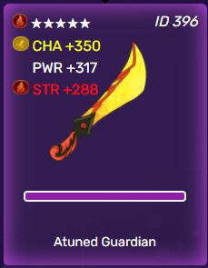
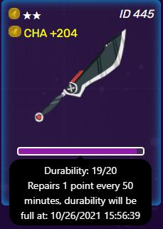
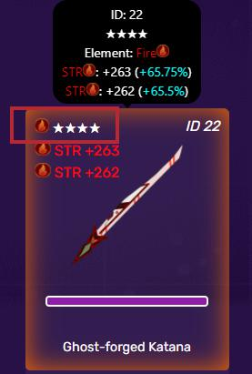

# Vũ Khí

Không cần phải nói rằng vũ khí là một trụ cột thiết yếu của NFT. Để tham gia vào trò chơi, người chơi bắt buộc phải sở hữu vũ khí của riêng mình, có thể được sử dụng đầy đủ cho các giao dịch trong trò chơi như giao dịch, nhận xBlade và kiếm tiền. Điều khác biệt giữa vũ khí với các nhân vật là số lượng vũ khí không giới hạn trong mỗi tài khoản.

To keep weapon-minting-price under surveillance, please press on the “Forge” button in the Blacksmith tab for further information.

It is worth noting that each weapon is assigned a random element and a random rarity, which is denoted by the number of stars shown on the weapon. The number of attributes along with the values rolled by these attributes is calibrated by the rarity of the weapon. Each weapon can be fully harnessed by all four of players’ characters and is not bound to a particular character. For that reason, forming a strong squad owning similar element appears to be an effective strategy to optimize the strength of the weapon.

For the time being, there is no method to adjust any of the weapon’s values.

## CWW - CryptoWar Weapon

CWW là viết tắt của CryptoWar Weapon, và là vũ khí NFT có trên ví của bạn.

Nếu bạn muốn CBW hiển thị trên ví MetaMask của mình, bạn có thể thêm mã thông báo thông qua địa chỉ hợp đồng được tìm thấy bên dưới:

> 0x52683412f6Ea2B6302ceA8406EfF928510466c2c


Set the decimal to "0" if prompted.


## Độ bền của vũ khí

Độ bền là khoảng thời gian mà người chơi có thể bắn kẻ thù bằng vũ khí có nghĩa là mỗi vũ khí sở hữu một độ bền nhất định để cắt giảm lượng thời gian dành cho mỗi vũ khí, đồng thời ngừng tận dụng vũ khí đó bằng cách chuyền nó đi. Đó là lý do mà vũ khí cần được hạ nhiệt sau mỗi trận chiến.

Do tốc độ hồi phục của nó ngang bằng với sức chịu đựng của nhân vật, độ bền giúp mỗi tài khoản có thể chiến đấu với bốn nhân vật bằng cùng một loại vũ khí. Hơn nữa, độ bền không ảnh hưởng đến tỷ lệ thắng hoặc chức năng của mỗi vũ khí khi chiến đấu.

## Chế Tạo Vũ Khí

Cùng với Nâng Cấp, Chế Tạo vũ khí là mục tiêu chính của trò chơi xBlade. Tất cả các chi phí của xBlade trên việc đúc vũ khí được chuyển trực tiếp đến các khoản thanh toán chiến đấu xử lý theo hợp đồng.

Độ hiếm của vũ khí được xác định ngẫu nhiên khi đúc. Hiện tại tỷ lệ của từng độ hiếm như sau:

* 1% cơ hội cho vũ khí 5 sao&#x20;
* 5% cơ hội cho vũ khí 4 sao&#x20;
* 15% cơ hội cho vũ khí 3 sao&#x20;
* 35% cơ hội cho vũ khí 2 sao&#x20;
* 44% cơ hội cho vũ khí 1 sao

Hiện tại không có gì đảm bảo rằng một lượng cuộn cụ thể sẽ mang lại độ hiếm cụ thể của vũ khí. Một số sinh ra đã may mắn nhưng càng làm việc càng gặp nhiều may mắn.

## Nguyên tố của Vũ Khí

Yếu tố của vũ khí được xác định ngẫu nhiên khi đúc. Vũ khí có chung các yếu tố với nhân vật (Lửa, Đất, Sấm Sét, Nước).

Nguyên tố của vũ khí được sử dụng để tính toán lượt người chơi tham gia chiến đấu.

Có thể tìm thấy thêm thông tin về đối sánh phần tử tại đây:


[fighting](../fighting/)

