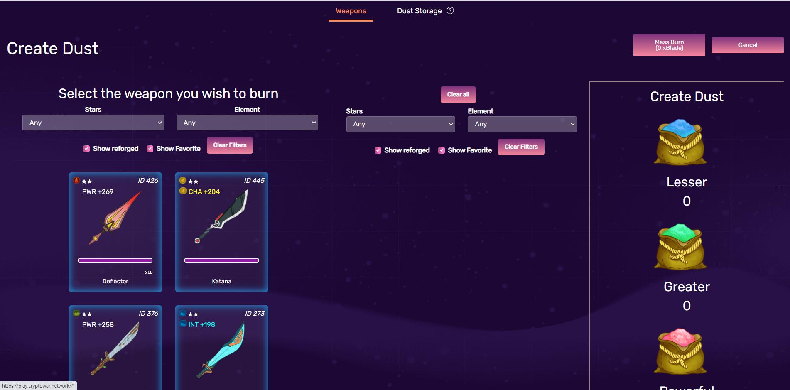
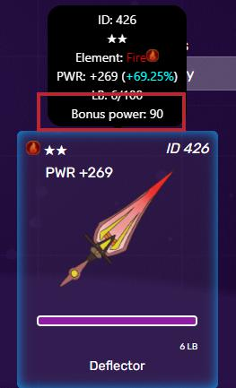

# Nâng cấp

.jpg>)

Nâng cấp vũ khí là quá trình sử dụng các mã thông báo xBlade để đốt một vũ khí này thành một vũ khí khác. Vũ khí mục tiêu nhận được sức mạnh cộng thêm, và vũ khí bị đốt cháy biến mất.

Cùng với việc rèn vũ khí, việc tái trang bị đóng vai trò là một trong hai điểm xBlade sử dụng trong trò chơi. Việc cường hóa cũng mang lại giá trị cho số lượng lớn vũ khí từ một đến ba sao mà người chơi có thể nhận được khi cố gắng rèn cho bốn hoặc năm sao.

## LB, 4B, and 5B

Một vũ khí được tinh chỉnh lại hiển thị thông tin mới khi di chuột qua. Đây là LB, 4B, 5B và Bonus Power.

LB là viết tắt của Low Star Burn và là tổng giá trị của vũ khí từ một đến ba sao bị cháy.

4B là viết tắt của Four Star Burn và là tổng giá trị của vũ khí bốn sao bị đốt cháy.

5B là viết tắt của Five Star Burn và là tổng giá trị của vũ khí năm sao bị cháy.

## Sức mạnh cộng thêm

Sức mạnh cộng thêm là một chỉ số mới có được khi nâng cấp, được sử dụng cùng với các thuộc tính vũ khí để xác định sức mạnh của người chơi cho các lượt chiến đấu.

Bạn có thể tìm thêm thông tin về cách sử dụng tại đây:


[fighting](../fighting/)


## Giá trị đốt vũ khí

Độ hiếm của vũ khí bị cháy sẽ xác định giá trị của nhóm đốt nào và đối với trường hợp LB xác định số điểm đốt để thêm vào.

LB, 4B và 5B có giới hạn tối đa độc lập với nhau và mỗi lần tăng điểm trong mỗi nhóm tương ứng sẽ đóng góp vào tổng Sức mạnh tiền thưởng của vũ khí.

Tham khảo bảng sau để biết số điểm ghi tối đa và sức mạnh thưởng cho mỗi điểm nhận được.

| Số sao của vũ khí đốt  | Pool | Chỉ số cộng thêm tối đa | Sức mạnh cộng thêm mỗi điểm chỉ số | Maximum Bonus Power |
| ---------------------- | ---- | ----------------------- | ---------------------------------- | ------------------- |
| 1-star, 2-star, 3-star | LB   | 100                     | 15                                 | 1500                |
| 4-star                 | 4B   | 25                      | 30                                 | 750                 |
| 5-star                 | 5B   | 10                      | 60                                 | 600                 |

Điều này có nghĩa là một vũ khí được tân trang lại hoàn toàn có thể có tối đa 2850 điểm sức mạnh cộng thêm.

## Điều kiện đốt

Tùy thuộc vào độ hiếm của vũ khí và giá trị hiện tại của hồ bơi, số lượng tăng lên mỗi lần đốt có thể thay đổi.

Hãy tham khảo phần sau để xác định số tiền chung sẽ tăng lên khi độ hiếm của vũ khí tương ứng bị cháy.

* Đốt vũ khí 1 sao tăng LB lên một&#x20;
* Đốt vũ khí 2 sao tăng LB lên hai.&#x20;
* Đốt vũ khí 3 sao tăng LB lên ba.&#x20;
* Đốt vũ khí 4 sao luôn tăng thêm một 4B.&#x20;
* Đốt vũ khí 5 sao luôn tăng thêm một 5B.

## Giá Trị Mang Theo

Khi sử dụng vũ khí đã được tân trang lại làm vũ khí đốt, một nửa LB, 4B và 5B của vũ khí đốt sẽ được chuyển sang vũ khí mới.

Trong trường hợp số thập phân do chia LB, 4B và 5B được đánh số lẻ, số đó được làm tròn xuống 0.


Một vũ khí có 50 LB sẽ chuyển 25 LB khi được sử dụng làm vũ khí đốt.

Vũ khí có 55 LB sẽ chuyển 27 LB khi được sử dụng làm vũ khí đốt.

