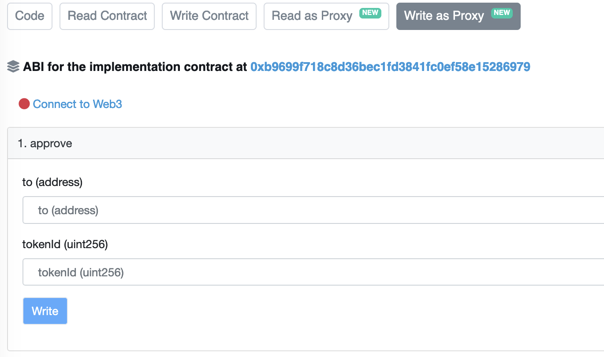

# Giao dịch

Người chơi có thể tự do thực hiện các giao dịch trong trò chơi với nhau bên ngoài thị trường thông qua việc sử dụng các hợp đồng thông minh NFT nhờ tài sản NFT của riêng họ. Giao dịch ký tự bằng cách sử dụng hợp đồng thông minh NFT có thể dẫn đến khóa giao dịch 24 giờ.


Người chơi nên biết rằng có những rủi ro về an toàn cho người chơi khi biến mình thành nạn nhân của những trò gian lận hoặc lừa đảo khi thực hiện các giao dịch ngang hàng. Trong bất kỳ trường hợp nào, nhóm CryptoWar sẽ không chịu trách nhiệm về bất kỳ tổn thất nào đối với xBlade hoặc NFT của người chơi trong trường hợp họ thực hiện giao dịch ngang hàng. Vì lý do đó, người chơi nên thực hiện tốt hơn các giao dịch trong trò chơi trên thị trường CryptoWar để giữ an toàn cho giao dịch của họ.


## Giao dịch Nhân Vật

Hợp đồng ký tự, có thể được khám phá ở liên kết bên dưới, được sử dụng để giao dịch các ký tự. Điều đáng chú ý là hợp đồng nhân vật hoàn toàn khác với hợp đồng vũ khí. Thông tin thêm về hợp đồng nhân vật có thể được tìm thấy tại đây:

&#x20;[**CryptoWar Character Trading Contract**](https://bscscan.com/address/0xc6f252c2cdd4087e30608a35c022ce490b58179b#writeProxyContract)

0xC38470BFE1b08c3baFDaf699eBa2fCA1fd2B040B&#x20;


Người chơi được cảnh báo để không giao dịch vũ khí trong hợp đồng nhân vật.


Vui lòng đảm bảo rằng ví nhận tiền của người chơi có thêm khe ký tự và nhân vật được đề cập không bị khóa giao dịch để thực hiện giao dịch đúng cách. Nếu mọi thứ được căn chỉnh hoàn hảo, hãy làm theo hướng dẫn bên dưới:

* Nhấp vào "**Connect to Web3**" như trong hình dưới đây và kết nối MetaMask của bạn.

Đi tới “Function 11- safeTransferFrom” và nhập vào dữ liệu như sau:

“from (address)” nghĩa là địa chỉ ví của người sở hữu

“to (address)” là địa chỉ ví của người nhận

“tokenID (uint256)” là ID của Hero bạn muốn gửi

Ấn " Write " . Thông báo xác nhận sẽ được gửi tới ví Metamask của bạn để xác nhận.

Trả phí gas và chờ giao dịch hoàn tất


Xin lưu ý rằng tài khoản của nhân vật là tài khoản được kết nối với hợp đồng


## Giao dịch Vũ Khí

Hợp đồng vũ khí, có thể xem ở liên kết bên dưới, chỉ được áp dụng cho vũ khí thương mại. Điều đáng chú ý là hợp đồng vũ khí hoàn toàn khác với hợp đồng nhân vật, trao quyền cho người chơi chỉ giao dịch vũ khí.

Xem thêm tại : [**CryptoWar Weapon Trading Contract**](https://bscscan.com/address/0x7e091b0a220356b157131c831258a9c98ac8031a#writeProxyContract)


PNgười chơi được cảnh báo về việc không giao dịch ký tự trên hợp đồng vũ khí.


Người chơi phải làm theo các hướng dẫn tương tự như họ đã làm đối với hợp đồng nhân vật.

1. Nhấp vào "**Connect to Web3**" như trong hình dưới đây và kết nối MetaMask của bạn.

Đi tới “Function 17- safeTransferFrom” và nhập vào dữ liệu như sau:

“from (address)” nghĩa là địa chỉ ví của người sở hữu

“to (address)” là địa chỉ ví của người nhận

“tokenID (uint256)” là ID của Vũ Khí bạn muốn gửi

Ấn " Write " . Thông báo xác nhận sẽ được gửi tới ví Metamask của bạn để xác nhận.

Trả phí gas và chờ giao dịch hoàn tất


Xin lưu ý rằng tài khoản của nhân vật là tài khoản được kết nối với hợp đồng.

