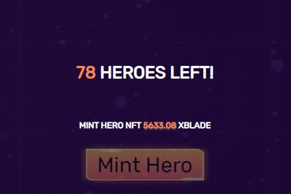

# Nhân Vật

## Nhân Vật Đầu Tiên

Người chơi có thể tiến hành các chiến lược hướng đến lợi nhuận của mình bằng cách đúc anh hùng đầu tiên của họ và có được vũ khí 1 sao tương thích với anh hùng của mình mà không mất phí. Người chơi có thể sử dụng bốn ký tự cùng một lúc. Có thể như vậy, chúng còn rất xa vời để sở hữu các yếu tố tương tự. Có rất nhiều chiến thuật để tìm kiếm một vũ khí mạnh mẽ cho các anh hùng của bạn, chẳng hạn như mua chúng trên thị trường, tiếp tục đúc hoặc bán những thứ không tương ứng chặt chẽ với yếu tố mong muốn của bạn. (Ví dụ: một thanh kiếm Lửa nên kết hợp hoàn hảo với 4 anh hùng Lửa)

Giả sử rằng người chơi có đủ tiền để mua các nhân vật đã cấp độ vì họ có thể phụ thuộc vào kinh nghiệm chơi, điều này tốn thời gian.


Mua nhân vật cũng có thể là một cách tốt để có được một mở đầu tăng giá tốt nhưng đừng bỏ qua vũ khí Bạn có thể tìm thêm thông tin về quy trình mua vũ khí trong nhóm Chiến lược và Hướng dẫn.


## Đội Hình 1 Nguyên Tố

Nếu bạn có được một thanh kiếm 4 sao hoặc 5 sao tốt của bất kỳ nguyên tố cụ thể nào, bạn có thể cố gắng kiếm được bốn nhân vật của cùng một nguyên tố để tất cả họ có thể chia sẻ và sử dụng một thanh kiếm tốt đó. Đúc kết một nhân vật là cách rẻ nhất để có được một nhân vật, tuy nhiên trạng thái hiện tại của trò chơi khuyến khích một đội đơn nguyên tố vì có bốn nhân vật cùng nguyên tố có thể cho phép bạn tận dụng chỉ một thanh kiếm tuyệt vời.

## Khi nào nên nhận EXP ?

Nhân vật có cấp độ càng cao phần thưởng nhận được càng lớn nhưng đồng thời thời gian hồi điểm năng lượng cũng sẽ tăng lên, người chơi nên cân nhắc trước khi nhận EXP và lên cấp cho nhân vật của mình.

Hãy tham khảo thêm tại mục này để biết khi nào đủ EXP cho việc lên cấp và nhận về để tránh lãng phí Gas nhé.


[experience-and-levels.md](../gameplay/what-are-characters/experience-and-levels.md)

