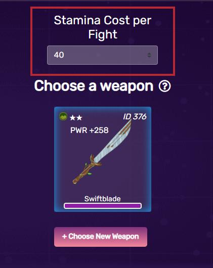
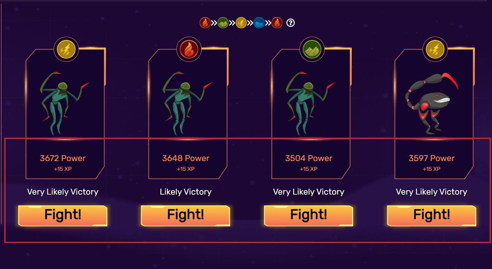

# Chiến Đấu

## Nên dùng bao nhiêu điểm năng lượng ?

Mặc dù tiêu tốn nhiều sức chịu đựng hơn có nghĩa là bạn có thể thắng trận đấu nhanh hơn, nhưng phần thưởng trả về vẫn giống nhau khi tính vào phí xăng và khoản thanh toán trung bình trở nên nhỏ hơn trong thời gian dài nếu người chơi thua trận.

Mặc dù tiêu tốn nhiều sức chịu đựng hơn có nghĩa là bạn có thể thắng trận đấu nhanh hơn, nhưng phần thưởng trả về vẫn giống nhau khi tính vào phí xăng và khoản thanh toán trung bình trở nên nhỏ hơn trong thời gian dài nếu người chơi thua trận.

## Lựa Chọn Quái Vật

Phạm vi kẻ thù mà bạn có thể chiến đấu là ngẫu nhiên nhưng vẫn theo một công thức không được tiết lộ dựa trên nhân vật và vũ khí của bạn. Do đó, bạn có thể đánh bại toàn bộ hoặc không có gì cả vì các yếu tố tài khoản không có trong công thức này. Do đó, bạn có thể tăng đáng kể tỷ lệ chiến thắng của mình bằng cách chọn một con quái vật có yếu tố mà nhân vật và vũ khí của bạn có lợi thế hơn. Không nên chọn những người có lợi thế hơn các yếu tố của bạn vì có nhiều khả năng bạn sẽ bị lỗ.

## Làm Mới Mỗi Giờ

Đôi khi bạn có thể gặp xui xẻo và nhận được một lô đầy quái vật mà bạn không có lợi thế về mặt nguyên tố để chống lại. Nếu bạn vẫn còn sức chịu đựng, bạn nên đợi một đợt ngẫu nhiên mới, diễn ra hàng giờ lúc UTC + 0. Để tránh lỗi EVM, tất cả người chơi sẽ không thể bắt đầu trận chiến trong 30 giây cuối mỗi giờ. Trong khoảng thời gian 30 giây này, người chơi nên đợi hàng giờ mới bắt đầu và không bắt đầu bất kỳ cuộc chiến nào vì việc bỏ sót quái vật có thể gây ra lỗi giao dịch.

## Sức Mạnh Cao Hơn và Thấp Hơn

Sức mạnh của quái vật dao động ± 20% giá trị dự đoán. Vì lý do đó, có rất nhiều sự thay đổi, đặc biệt là khi cấp độ nhân vật của người chơi tăng lên. Lựa chọn nhắm mục tiêu vào kẻ thù có sức mạnh cao chống lại kẻ thù có sức mạnh thấp phụ thuộc vào việc lựa chọn tỷ lệ thanh toán trên chiến thắng. Chiến đấu với kẻ thù mạnh mẽ có thể có nguy cơ thất bại trò chơi nhưng tăng cơ hội nhận được nhiều kinh nghiệm hơn cũng như thanh toán xBlade và ngược lại. Người chơi mới được khuyến khích chọn những kẻ thù có sức mạnh thấp hơn để duy trì điểm thưởng xBlade và điểm kinh nghiệm của họ.
